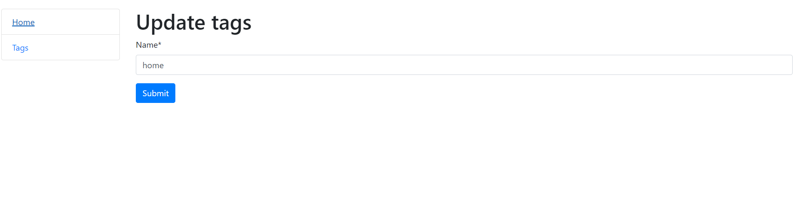

# Todo list Manager

## Description

This project to-do list site.

## Installation

1. $ git clone https://github.com/mtiunov/todo-list
2. cd todo-list
3. python3 -m venv venv
4. source venv/bin/activate
5. pip install -r requirements.txt
6. python manage.py runserver #starts Django Server

## Appurtenances

- Django 3.0
- Python 3.8

## Contribution

If you want to help in the development of the project, please create a request pool.

## Demo

## Author

- Tiunov Mykhailo ([@mtiunov](https://github.com/mtiunov/))